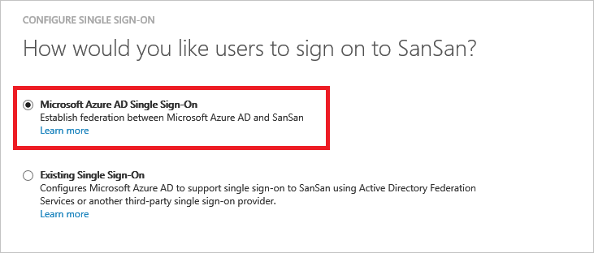
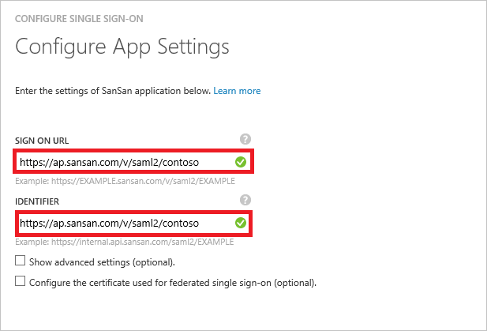
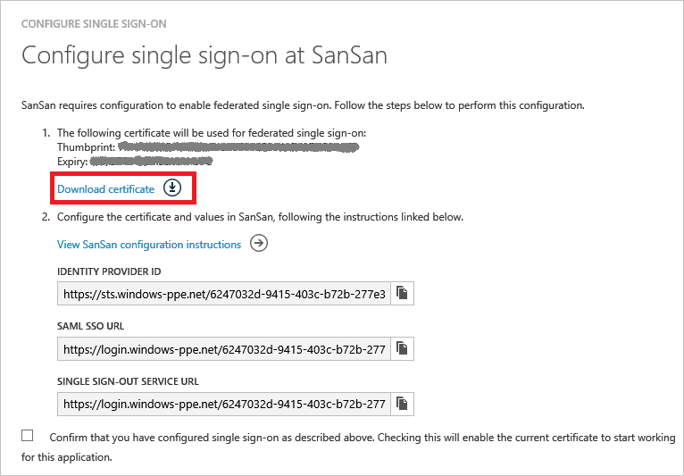

<properties
	pageTitle="Tutorial: Azure Active Directory integration with SanSan | Microsoft Azure"
	description="Learn how to configure single sign-on between Azure Active Directory and SanSan."
	services="active-directory"
	documentationCenter=""
	authors="jeevansd"
	manager="femila"
	editor=""/>

<tags
	ms.service="active-directory"
	ms.workload="identity"
	ms.tgt_pltfrm="na"
	ms.devlang="na"
	ms.topic="article"
	ms.date="07/20/2016"
	ms.author="jeedes"/>

# Tutorial: Azure Active Directory integration with SanSan

In this tutorial, you learn how to integrate SanSan with Azure Active Directory (Azure AD).

Integrating SanSan with Azure AD provides you with the following benefits:

- You can control in Azure AD who has access to SanSan
- You can enable your users to automatically get signed-on to SanSan (Single Sign-On) with their Azure AD accounts
- You can manage your accounts in one central location - the Azure classic portal

If you want to know more details about SaaS app integration with Azure AD, see [What is application access and single sign-on with Azure Active Directory](active-directory-appssoaccess-whatis.md).

## Prerequisites

To configure Azure AD integration with SanSan, you need the following items:

- An Azure AD subscription
- A SanSan single-sign on enabled subscription

> [AZURE.NOTE] To test the steps in this tutorial, we do not recommend using a production environment.

To test the steps in this tutorial, you should follow these recommendations:

- You should not use your production environment, unless this is necessary.
- If you don't have an Azure AD trial environment, you can get a one-month trial [here](https://azure.microsoft.com/pricing/free-trial/).

## Scenario description
In this tutorial, you test Azure AD single sign-on in a test environment. 
The scenario outlined in this tutorial consists of two main building blocks:

1. Adding SanSan from the gallery
2. Configuring and testing Azure AD single sign-on

## Adding SanSan from the gallery
To configure the integration of SanSan into Azure AD, you need to add SanSan from the gallery to your list of managed SaaS apps.

**To add SanSan from the gallery, perform the following steps:**

1. In the **Azure classic portal**, on the left navigation pane, click **Active Directory**. 

	![Active Directory][1]

2. From the **Directory** list, select the directory for which you want to enable directory integration.

3. To open the applications view, in the directory view, click **Applications** in the top menu.

	![Applications][2]

4. Click **Add** at the bottom of the page.

	![Applications][3]

5. On the **What do you want to do** dialog, click **Add an application from the gallery**.

	![Applications][4]

6. In the search box, type **SanSan**.

	

7. In the results pane, select **SanSan**, and then click **Complete** to add the application.

	

##  Configuring and testing Azure AD single sign-on
In this section, you configure and test Azure AD single sign-on with SanSan based on a test user called "Britta Simon".

For single sign-on to work, Azure AD needs to know what the counterpart user in SanSan is to a user in Azure AD. In other words, a link relationship between an Azure AD user and the related user in SanSan needs to be established.
This link relationship is established by assigning the value of the **user name** in Azure AD as the value of the **Username** in SanSan.

To configure and test Azure AD single sign-on with SanSan, you need to complete the following building blocks:

1. **[Configuring Azure AD Single Sign-On](#configuring-azure-ad-single-single-sign-on)** - to enable your users to use this feature.
2. **[Creating an Azure AD test user](#creating-an-azure-ad-test-user)** - to test Azure AD single sign-on with Britta Simon.
4. **[Creating an SanSan test user](#creating-an-sansan-test-user)** - to have a counterpart of Britta Simon in SanSan that is linked to the Azure AD representation of her.
5. **[Assigning the Azure AD test user](#assigning-the-azure-ad-test-user)** - to enable Britta Simon to use Azure AD single sign-on.
5. **[Testing Single Sign-On](#testing-single-sign-on)** - to verify whether the configuration works.

### Configuring Azure AD single sign-on

In this section, you enable Azure AD single sign-on in the classic portal and configure single sign-on in your SanSan application.

**To configure Azure AD single sign-on with SanSan, perform the following steps:**

1. In the Azure classic portal, on the **SanSan** application integration page, click Configure single sign-on to open the Configure Single Sign-On dialog.

	 

2. On the **How would you like users to sign on to SanSan** page, select **Azure AD Single Sign-On**, and then click **Next**.
 	
	 

3. On the **Configure App Settings** dialog page, perform the following steps:

	 

	a. In the **Sign On URL** textbox, type the URL in the following pattern:

    | Environment             | URL |
    | :--                     | :-- |
    | PC web                  | `https://ap.sansan.com/v/saml2/<company name>/acs`|
    | Native Mobile app       | `https://internal.api.sansan.com/saml2/<company name>/acs` |
    | Mobile browser settings | `https://ap.sansan.com/s/saml2/<company name>/acs` |

	b. In the **Identifier** textbox type the URL in the following pattern: 

    | Environment             | URL |
    | :--                     | :-- |
    | PC web                  | `https://ap.sansan.com/v/saml2/<company name>`|
    | Native Mobile app       | `https://internal.api.sansan.com/saml2/<company name>` |
    | Mobile browser settings | `https://ap.sansan.com/s/saml2/<company name>` |

    c. Click **Next**.

4. On the **Configure single sign-on at SanSan** page, perform the following steps:

	 

    a. Click **Download certificate**, and then save the file on your computer.

    b. Click **Next**.

5.  To get SSO configured for your application, contact SanSan Support team and they will assist to configure SSO. Please provide them with the following information :

	• The downloaded **certificate**

	• The **Identity Provider ID**

	• The **SAML SSO URL**

	• The **Single Sign Out Service URL**

> [AZURE.NOTE] PC browser setting also work for Mobile app and Mobile browser along with PC web. 

6. In the classic portal, select the single sign-on configuration confirmation, and then click **Next**.
	
	![Azure AD Single Sign-On][10]

7. On the **Single sign-on confirmation** page, click **Complete**.  
  	
	![Azure AD Single Sign-On][11]

### Creating an Azure AD test user

In this section, you create a test user in the classic portal called Britta Simon.
In the Users list, select **Britta Simon**.

![Create Azure AD User][20]

**To create a test user in Azure AD, perform the following steps:**

1. In the **Azure classic portal**, on the left navigation pane, click **Active Directory**.
	
	 

2. From the **Directory** list, select the directory for which you want to enable directory integration.

3. To display the list of users, in the menu on the top, click **Users**.
	
	 

4. To open the **Add User** dialog, in the toolbar on the bottom, click **Add User**.

	 

5. On the **Tell us about this user** dialog page, perform the following steps:
 
	 

    a. As Type Of User, select New user in your organization.

    b. In the User Name **textbox**, type **BrittaSimon**.

    c. Click **Next**.

6.  On the **User Profile** dialog page, perform the following steps:

	 

    a. In the **First Name** textbox, type **Britta**.  

    b. In the **Last Name** textbox, type, **Simon**.

    c. In the **Display Name** textbox, type **Britta Simon**.

    d. In the **Role** list, select **User**.

    e. Click **Next**.

7. On the **Get temporary password** dialog page, click **create**.

	 

8. On the **Get temporary password** dialog page, perform the following steps:

	 

    a. Write down the value of the **New Password**.

    b. Click **Complete**.   

### Creating an SanSan test user

In this section, you create a user called Britta Simon in SanSan. SanSan application need the user to be provisioned in the application before doing SSO. 

> [AZURE.NOTE] If you need to create a user manually or batch of users, you need to contact the SanSan support team.

### Assigning the Azure AD test user

In this section, you enable Britta Simon to use Azure single sign-on by granting her access to SanSan.

![Assign User][200] 

**To assign Britta Simon to SanSan, perform the following steps:**

1. On the classic portal, to open the applications view, in the directory view, click **Applications** in the top menu.

	![Assign User][201] 

2. In the applications list, select **SanSan**.

	 

1. In the menu on the top, click **Users**.

	![Assign User][203] 

1. In the Users list, select **Britta Simon**.

2. In the toolbar on the bottom, click **Assign**.

	![Assign User][205]

### Testing single sign-on

In this section, you test your Azure AD single sign-on configuration using the Access Panel.
When you click the SanSan tile in the Access Panel, you should get automatically signed-on to your SanSan application.

## Additional resources

* [List of Tutorials on How to Integrate SaaS Apps with Azure Active Directory](active-directory-saas-tutorial-list.md)
* [What is application access and single sign-on with Azure Active Directory?](active-directory-appssoaccess-whatis.md)

<!--Image references-->

[1]: ./media/active-directory-saas-sansan-tutorial/tutorial_general_01.png
[2]: ./media/active-directory-saas-sansan-tutorial/tutorial_general_02.png
[3]: ./media/active-directory-saas-sansan-tutorial/tutorial_general_03.png
[4]: ./media/active-directory-saas-sansan-tutorial/tutorial_general_04.png

[6]: ./media/active-directory-saas-sansan-tutorial/tutorial_general_05.png
[10]: ./media/active-directory-saas-sansan-tutorial/tutorial_general_06.png
[11]: ./media/active-directory-saas-sansan-tutorial/tutorial_general_07.png
[20]: ./media/active-directory-saas-sansan-tutorial/tutorial_general_100.png

[200]: ./media/active-directory-saas-sansan-tutorial/tutorial_general_200.png
[201]: ./media/active-directory-saas-sansan-tutorial/tutorial_general_201.png
[203]: ./media/active-directory-saas-sansan-tutorial/tutorial_general_203.png
[204]: ./media/active-directory-saas-sansan-tutorial/tutorial_general_204.png
[205]: ./media/active-directory-saas-sansan-tutorial/tutorial_general_205.png
